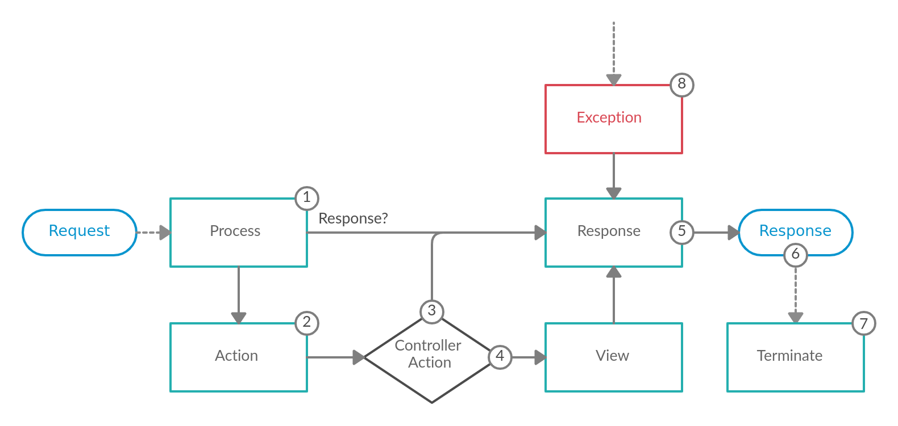

This section will focus on how each component is integrated into Athena, as well an overview of the overall design of Athena.

At a high level Athena's job is *to interpret a request and create the appropriate response based on your application logic*.  Conceptually this could be broken down into three steps:

1. Consume the request
2. Apply application logic to determine what the response should be
3. Return the response

Steps 1 and 3 are handled via Crystal's [HTTP::Server](https://crystal-lang.org/api/HTTP/Server.html), while step 2 is where Athena fits in.

## Powered By Events

Athena is an event based framework, meaning it emits various events via the [Event Dispatcher](./event_dispatcher.md) component during the life-cycle of a request.  These events are listened on internally in order to handle each request; custom listeners on these events can also be registered.  The flow of a request, and the related events that are emitted, is depicted below in  visual format:



### 1. Request Event

The very first event that is emitted is the [ART::Events::Request](https://athena-framework.github.io/athena/Athena/Routing/Events/Request.html) event and can have a varitey of listeners.  The primary purpose of this event is to create an [ART::Response](https://athena-framework.github.io/athena/Athena/Routing/Response.html) directly, or to add information to the requests' attributes; a simple key/value store tied to request instance accessible via `HTTP::Request#attributes`.

In some cases the listener may have enough information to return an [ART::Response](https://athena-framework.github.io/athena/Athena/Routing/Response.html) immediately.  An example of this would be the [ART::Listeners::CORS](https://athena-framework.github.io/athena/Athena/Routing/Listeners/CORS.html) listener.  If enabled it is able to return a CORS preflight response even before routing is invoked.

!!! warning
    If an [ART::Response](https://athena-framework.github.io/athena/Athena/Routing/Response.html) is returned at this stage, the flow of the request skips directly to the [response](#5-response-event) event.  Future `Request` event listeners will not be invoked either.

Another use case for this event is populating additional data into the request's attributes; such as the locale or format of the request.

!!! example "Request event in Athena"
    This is the event that [ART::Listeners::Routing](https://athena-framework.github.io/athena/Athena/Routing/Listeners/Routing.html) listens on to determine which [ART::Controller](https://athena-framework.github.io/athena/Athena/Routing/.html)/[ART::Action](https://athena-framework.github.io/athena/Athena/Routing/Action.html) pair should handle the request.
    
    See [ART::Controller](https://athena-framework.github.io/athena/Athena/Routing/Controller.html) for more details on routing.

### 2. Action Event

The next event to be emitted is the [ART::Events::Action](https://athena-framework.github.io/athena/Athena/Routing/Events/Action.html) event, assuming a response was not already returned within the `Request` event.  This event is emitted after the related controller/action pair is determined, but before it is executed.  This event is intended to be used when a listener requires information from the related [ART::Action](https://athena-framework.github.io/athena/Athena/Routing/Action.html); such as reading custom annotations off of it via the [Config](./config.md) component.

!!! example "Action event in Athena"
    This is the event that [ART::Listeners::ParamConverter](https://athena-framework.github.io/athena/Athena/Routing/Listeners/ParamConverter.html) and [ART::Listeners::ParamFetcher](https://athena-framework.github.io/athena/Athena/Routing/Listeners/ParamFetcher.html) listen on to apply custom conversion logic via an [ART::ParamConverterInterface](https://athena-framework.github.io/athena/Athena/Routing/ParamConverterInterface.html), or resolve request parameters such as [ART::QueryParam](https://athena-framework.github.io/athena/Athena/Routing/QueryParam.html)s.

### 3. Invoke the Controller Action

This next step is not an event, but a important concept within Athena nonetheless; executing the controller action related to the current request.

#### Argument Resolution

Before Athena can call the controller action, it first needs to determine what arguments, if any, should be passed to it.  This is achieved via an [ART::Arguments::ArgumentResolverInterface](https://athena-framework.github.io/athena/Athena/Routing/Arguments/ArgumentResolverInterface.html) that facilitates gathering all the arguments.  One or more [ART::Arguments::Resolvers::ArgumentValueResolverInterface](https://athena-framework.github.io/athena/Athena/Routing/Arguments/Resolvers/ArgumentValueResolverInterface.html) will then be used to resolve each specific argument's value.

The default algorithm is as follows:

1. Check the request attributes for a key that matches the name of the argument
	* Such as as a path param or something set via a listener (either built-in or custom)
2. Check if the type of the argument is `HTTP::Request`, if so use the current request object
3. Check if the argument has a default value, or use `nil` if it is nilable
4. Raise an exception if an argument's value could be not resolved

Custom `ArgumentValueResolverInterface`s may be created & registered to extend this functionality.

!!! todo
    An additional event could possibly be added after the arguments have been resolved, but before invoking the controller action.

#### Execute the Controller Action

The job of a controller action is to apply business/application logic to build a response for the related request; such as an HTML page, a JSON string, or anything else.  How/what exactly this should be is up to the developer creating the application.

#### Handle the Response

The type of the value returned from the controller action determines what happens next.  If the value is an [ART::Response](https://athena-framework.github.io/athena/Athena/Routing/Response.html), then it is used as is, skipping directly to the [response](#5-response-event) event.  However, if the value is _NOT_ an [ART::Response](https://athena-framework.github.io/athena/Athena/Routing/Response.html), then the [view](#4-view-event) is emitted (since Athena _needs_ an [ART::Response](https://athena-framework.github.io/athena/Athena/Routing/Response.html) in order to have something to send back to the client).

### 4. View Event

The [ART::Events::View](https://athena-framework.github.io/athena/Athena/Routing/Events/View.html) event is only emitted when the controller action does _NOT_ return an [ART::Response](https://athena-framework.github.io/athena/Athena/Routing/Response.html).  The purpose of this event is to turn the controller action's return value into an [ART::Response](https://athena-framework.github.io/athena/Athena/Routing/Response.html).

This event is intended to be used as a "View" layer; allowing scalar values/objects to be returned while listeners convert that value to the expected format (e.g. JSON, HTML, etc.).

!!! example "View event in Athena"
    By default Athena will JSON serialize any non [ART::Response](https://athena-framework.github.io/athena/Athena/Routing/Response.html) values.

### 5. Response Event

The end goal of Athena is to return an [ART::Response](https://athena-framework.github.io/athena/Athena/Routing/Response.html) back to the client; which might be created within the [request](#1-request-event) event, returned from the related controller action, or set within the [view](#4-view-event) event.  Regardless of how the response was created, the [ART::Events::Response](https://athena-framework.github.io/athena/Athena/Routing/Events/Response.html) event is emitted directly after.

The intended use case for this event is to allow for modifying the response object in some manner.  Common examples include: add/edit headers, add cookies, change/compress the response body.

### 6. Return the Response

The raw [HTTP::Server::Response](https://crystal-lang.org/api/HTTP/Server/Response.html) object is never directly exposed.  The reasoning for this is to allow listeners to mutate the response before it is returned as mentioned in the [response](#5-response-event) event section.  If the raw response object was exposed, whenever any data is written to it it'll immediately be sent to the client and the status/headers will be locked; as mentioned in the Crystal API docs:

> The response `#status` and `#headers` must be configured before writing the response body. Once response output is written, changing the `#status` and `#headers` properties has no effect.

Each [ART::Response](https://athena-framework.github.io/athena/Athena/Routing/Response.html) has a [ART::Response::Writer](https://athena-framework.github.io/athena/Athena/Routing/Response/Writer.html) instance that determines _how_ the response should be written to the raw response's IO.  By default it is written directly, but can be customized via the [response](#5-response-event), such as for compression.

#### 7. Terminate Event


#### 8. Exception Handling

## Extensions

Athena comes bundled with some additional potentially useful components (shards).
Due to the nature of Crystal's build process, any types/methods that are not used, are not included in the resulting binary.
Thus if your project does not use any of these extensions, the resulting binary will be unchanged.
However by having them included by default, they are available and ready to go when/if the need arises.
It's also worth noting that these extra components are not Athena specific and can be used within any project/library outside of the Athena ecosystem.

These extensions register additional component specific types as services with the service container.
This allows them to be injected via DI into your `Athena::Routing` related types, such as controllers, param converters, and/or event listeners.

### Serialization

The `Athena::Serializer` component adds enhanced (de)serialization features.
See the API documentation for more detailed information, or [this forum post](https://forum.crystal-lang.org/t/athena-0-11-0/2627) for a quick overview.

Some highlights:

* `ASRA::Name` - Supporting different keys when deserializing versus serializing
* `ASRA::VirtualProperty` - Allow a method to appear as a property upon serialization
* `ASRA::IgnoreOnSerialize` - Allow a property to be set on deserialization, but should not be serialized (or vice versa)
* `ASRA::Expose` - Allows for more granular control over which properties should be (de)serialized
* `ASR::ExclusionStrategies` - Allows defining runtime logic to determine if a given property should be (de)serialized
* `ASR::ObjectConstructorInterface` - Determine how a new object is constructed during deserialization, e.x. sourcing an object from the DB

#### Dependency Injection

This extension registers the following types as services:

* `ASR::Serializer`

### Validation

The `Athena::Validator` component adds a robust/flexible validation framework.
See the API documentation for more detailed information, or [this forum post]() for a quick overview.

#### Dependency Injection

This extension registers the following types as services:

* `AVD::Validator::RecursiveValidator`

#### Custom Constraints

In addition to the general information for defining [Custom Constraints](https://athena-framework.github.io/validator/Athena/Validator/Constraint.html#custom-constraints),
the validator component defines a specific type for defining service based constraint validators: `AVD::ServiceConstraintValidator`.
This type should be inherited from instead of `AVD::ConstraintValidator` _IF_ the validator for your custom constraint needs to be a service, E.x.

```crystal
class Athena::Validator::Constraints::CustomConstraint < AVD::Constraint
  # ...

  @[ADI::Register]
  struct Validator < AVD::ServiceConstraintValidator
    def initialize(...); end

    # :inherit:
    def validate(value : _, constraint : AVD::Constraints::CustomConstraint) : Nil
      # ...
    end
  end
end
```